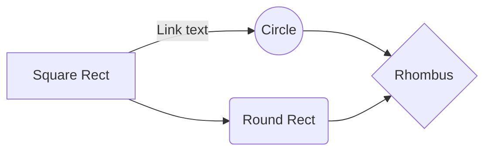
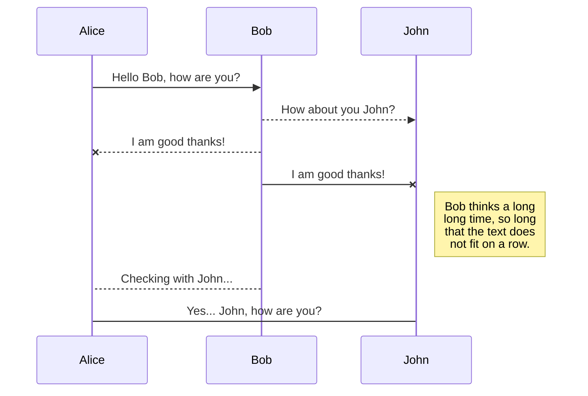
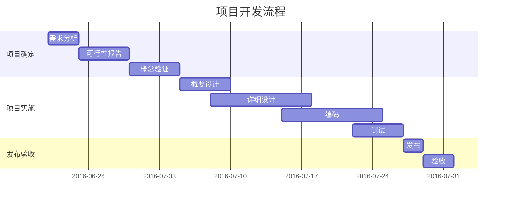
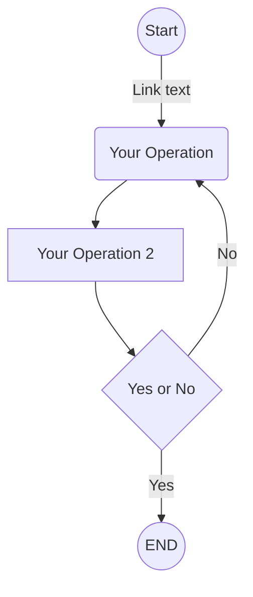
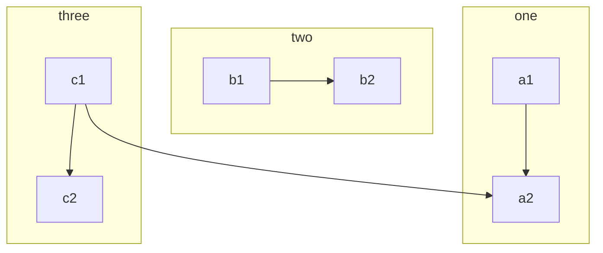
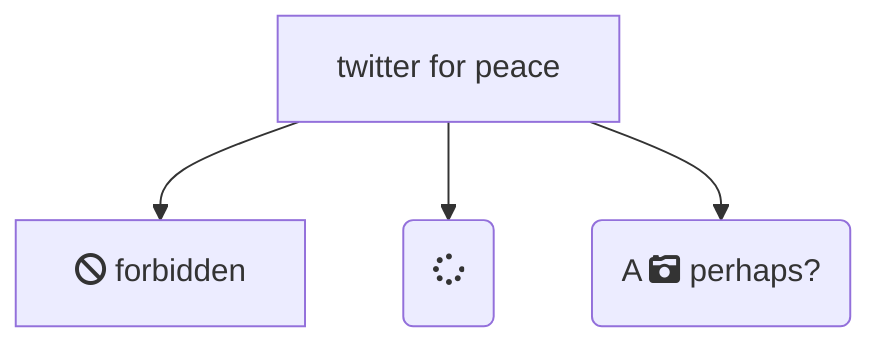
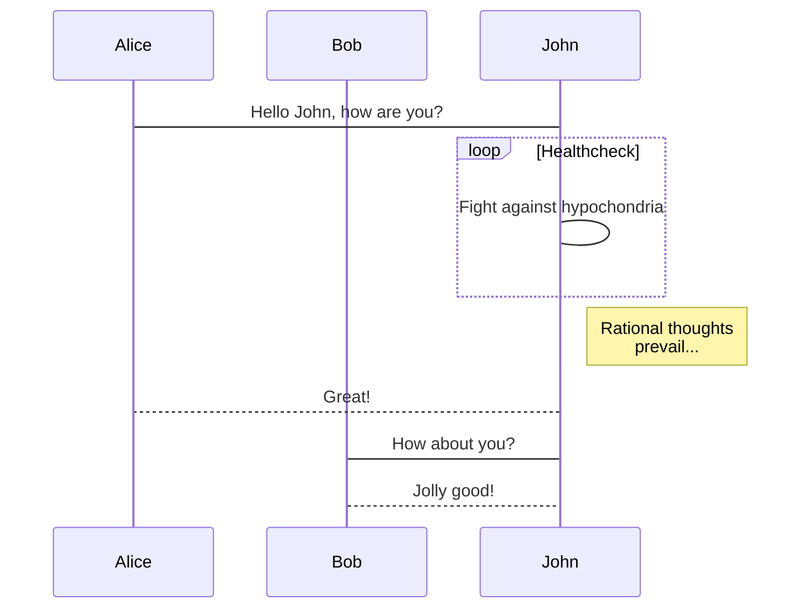

>来自李南希发的手册

# Markdown 简明语法手册

### 1. 斜体和 粗体, 高亮

使用 * 和 **表示斜体,粗体。

示例：

这是 *斜体*，这是 **粗体**。

### 2. 分级标题

使用 # 表示一级标题，使用 ## 表示二级标题。

示例：

```
# 这是一个一级标题
## 这是一个二级标题
### 这是一个三级标题
#### 这是一个四级标题
##### 这是一个五级标题
```

### 3. 外链接

使用 \[描述](链接地址) 为文字增加外链接。

示例：

这是去往 [我的主页](http://v.lijunni.com) 的链接。

### 4. 无序列表

使用 *，+，- 表示无序列表。

示例：

- 无序列表项 一
- 无序列表项 二
- 无序列表项 三

### 5. 有序列表

使用数字和点表示有序列表。

示例：

1. 有序列表项 一
2. 有序列表项 二
3. 有序列表项 三

### 6. 文字引用

使用 > 表示文字引用。

示例：

> 野火烧不尽，春风吹又生。

### 7. 行内代码块

使用 \`代码` 表示行内代码块。

示例：

让我们聊聊 `html`。

### 8.  代码块

使用 四个缩进空格 表示代码块。

示例：

```python
这是一个代码块，此行左侧有四个不可见的空格。
@requires_authorization
class SomeClass:
    pass

if __name__ == '__main__':
    # A comment
    print 'hello world'
```

### 9.  插入图像

使用 \!\[描述](图片链接地址) 插入图像。

示例：


#  Markdown 高阶语法手册

### 1. 内容目录

在段落中填写 `[TOC]` 以显示全文内容的目录结构。

[TOC]

### 2. 删除线

使用 ~~ 表示删除线。

~~这是一段错误的文本。~~

### 3. 注脚

使用 `[^keyword]` 表示注脚。

这是一个注脚[^footnote]的样例。

这是第二个注脚[^footnote2]的样例。

### 4. LaTeX 公式

$ 表示行内公式： 

质能守恒方程$E=mc^2$可以用一个很简洁的方程式 `$E=mc^2$`  来表达。

$$ 表示整行公式：

$$\sum_{i=1}^n a_i=0$$

$$f(x_1,x_x,\ldots,x_n) = x_1^2 + x_2^2 + \cdots + x_n^2 $$

$$\sum^{j-1}_{k=0}{\widehat{\gamma}_{kj} z_k}$$

访问 [MathJax](http://meta.math.stackexchange.com/questions/5020/mathjax-basic-tutorial-and-quick-reference) 参考更多使用方法。

### 5. 加强的代码块

支持四十一种编程语言的语法高亮的显示，行号显示。

非代码示例：

```
$ sudo apt-get install vim-gnome
```

Python 示例：

```python
@requires_authorization
def somefunc(param1='', param2=0):
    '''A docstring'''
    if param1 > param2: # interesting
        print 'Greater'
    return (param2 - param1 + 1) or None

class SomeClass:
    pass

>>> message = '''interpreter
... prompt'''
```

JavaScript 示例：

``` javascript
/**
* nth element in the fibonacci series.
* @param n >= 0
* @return the nth element, >= 0.
*/
function fib(n) {
  var a = 1, b = 1;
  var tmp;
  while (--n >= 0) {
    tmp = a;
    a += b;
    b = tmp;
  }
  return a;
}

document.write(fib(10));
```

### 6. 流程图

#### 示例



#### 更多语法参考：[流程图语法参考](https://knsv.github.io/mermaid/#flowcharts-basic-syntax)

### 7. 序列图



#### 更多语法参考：[序列图语法参考](https://knsv.github.io/mermaid/#sequence-diagrams)

### 8. 甘特图

甘特图内在思想简单。基本是一条线条图，横轴表示时间，纵轴表示活动（项目），线条表示在整个期间上计划和实际的活动完成情况。它直观地表明任务计划在什么时候进行，及实际进展与计划要求的对比。



#### 更多语法参考：[甘特图语法参考](https://knsv.github.io/mermaid/#gant-diagrams)

### 9. Mermaid 流程图







#### 更多语法参考：[Mermaid 流程图语法参考](https://knsv.github.io/mermaid/#flowcharts-basic-syntax)

### 10. Mermaid 序列图



#### 更多语法参考：[Mermaid 序列图语法参考](https://knsv.github.io/mermaid/#sequence-diagrams)

### 11. 表格支持

| 项目   |     价格 |  数量  |
| ---- | -----: | :--: |
| 计算机  | \$1600 |  5   |
| 手机   |   \$12 |  12  |
| 管线   |    \$1 | 234  |


### 12. 定义型列表

名词 1
:   定义 1（左侧有一个可见的冒号和四个不可见的空格）

代码块 2
:   这是代码块的定义（左侧有一个可见的冒号和四个不可见的空格）

        代码块（左侧有八个不可见的空格）


### 13. **Emoji 😆**

可以用类似 `:smile:`的方式输入Emoji表情。

User can trigger auto-complete suggestions for emoji by pressing `ESC` key, or trigger it automatically after enable it on preference panel. Also, input UTF8 emoji char directly from `Edit` -> `Emoji & Symbols` from menu bar is also supported. 

### 14. 待办事宜 Todo 列表

使用带有 [ ] 或 [x] （未完成或已完成）项的列表语法撰写一个待办事宜列表，并且支持子列表嵌套以及混用Markdown语法，例如：

    - [ ] 改进 Cmd 渲染算法，使用局部渲染技术提高渲染效率
    - [ ] 支持以 PDF 格式导出文稿
    - [x] 新增Todo列表功能
    - [x] 改进 LaTex 功能
          - [x] 修复 LaTex 公式渲染问题
          - [x] 新增 LaTex 公式编号功能

对应显示如下待办事宜 Todo 列表：

- [ ] 改进 Cmd 渲染算法，使用局部渲染技术提高渲染效率
- [ ] 支持以 PDF 格式导出文稿
- [x] 新增Todo列表功能 [语法参考](https://github.com/blog/1375-task-lists-in-gfm-issues-pulls-comments)
- [x] 改进 LaTex 功能
      - [x] 修复 LaTex 公式渲染问题
      - [x] 新增 LaTex 公式编号功能 [语法参考](http://docs.mathjax.org/en/latest/tex.html#tex-eq-numbers)

### 15. Html 标签（不推荐使用）

- Underline: `<u>underline</u>` <u>underline</u>
- Image: `` (And `width`, `height` attribute in HTML tag, and `width`, `height`, `zoom` style in `style` attribute will be applied.) 
- 
- Comments: `<!-- This is some comments -->` <!-- This is some comments -->
- Hyperlink: `<a href="http://typora.io" target="_blank">link</a>`.

它们的大多数属性，样式或类将被忽略。 对于其他标记，typora将它们作为原始HTML代码段。

因此**尽可能地不要使用任何HTML代码** 

## 16. 其他

==高亮==: 这是一个 *高亮* 的 **文本**。

[^footnote]: 这是一个 *注脚* 的 **文本**。

[^footnote2]: 这是另一个 *注脚* 的 **文本**。

[^LaTeX]: 支持 **LaTeX** 编辑显示支持，例如：$\sum_{i=1}^n a_i=0$， 访问 [MathJax][1] 参考更多使用方法。

[^code]: 代码高亮功能支持包括 Java, Python, JavaScript 在内的，**四十一**种主流编程语言。

[1]: http://meta.math.stackexchange.com/questions/5020/mathjax-basic-tutorial-and-quick-reference

